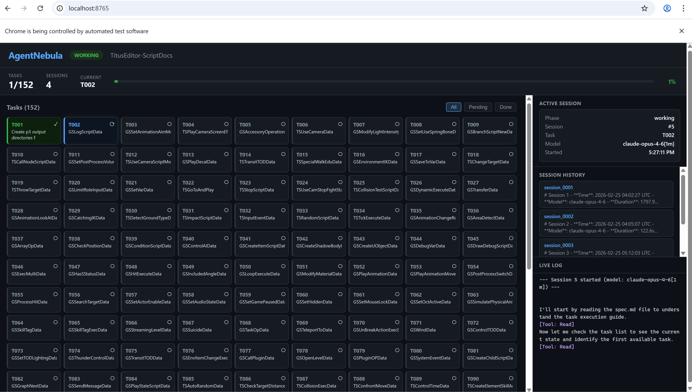

# AgentNebula

A universal infinite-loop agent workflow engine powered by Claude Code SDK. AgentNebula drives Claude to autonomously work through large task lists — one session at a time, with full state persistence, automatic recovery, and a real-time web dashboard.

## The Problem

Many real-world tasks require an AI agent to work for hours or days:
- Generating documentation for 150+ source files
- Migrating a large codebase from one framework to another
- Writing tests for every module in a project
- Batch-processing data with AI analysis

A single Claude session can't handle this — context windows fill up, sessions time out, and progress is lost. Running these manually means babysitting the agent and losing state between sessions.

## The Solution

AgentNebula implements the **"shift engineer" pattern** from Anthropic's [Effective Harnesses for Long-Running Agents](https://www.anthropic.com/engineering/effective-harnesses-for-long-running-agents):

- Each session starts fresh with a clean context window
- State is persisted to disk (task list, progress notes, session history)
- The orchestrator loop runs indefinitely: pick task → run session → save state → repeat
- A web dashboard shows real-time progress with task visualization

```
while has_pending_tasks:
    task = pick_next_task()
    session = launch_claude(task)       # Fresh context, full tools
    session.execute()                    # Agent reads/writes project files
    save_state(task_list, progress)      # Persist to disk
    sleep(3s)                            # Ctrl+C window
```

## Architecture

```
┌──────────────────────────────────────────────────────────┐
│                    Orchestrator                           │
│                                                          │
│   ┌──────────┐    ┌───────────────┐    ┌──────────────┐  │
│   │ Phase 1   │───→│   Phase 2      │───→│  Dashboard   │  │
│   │Initializer│    │ Worker Loop    │    │  :8765       │  │
│   │           │    │                │    │              │  │
│   │ Read spec │    │ while(tasks):  │    │ Task grid    │  │
│   │ Generate  │    │   pick task    │    │ Live log     │  │
│   │ task_list │    │   run claude   │    │ Session view │  │
│   │           │    │   update state │    │ WebSocket    │  │
│   └──────────┘    └───────────────┘    └──────────────┘  │
│                                                          │
│   .agent-nebula/                                         │
│   ├── config.yaml          Project config + models       │
│   ├── spec.md              What to do (input)            │
│   ├── task_list.json       Tasks with status (DAG)       │
│   ├── progress.md          Free-form notes               │
│   ├── session_history/     Markdown summaries            │
│   └── session_messages/    Full JSONL recordings         │
└──────────────────────────────────────────────────────────┘
```

## Key Design Decisions

**workflow_dir vs cwd** — The workflow state directory and the Claude working directory are independent. A workflow in `~/workflows/my-docs/` can drive Claude to work in `/opt/game-engine/`. This means you can manage multiple workflows for the same project, or one workflow that spans multiple directories.

**One task per session** — Each session focuses on exactly one task. This prevents context pollution and makes progress atomic. If a session fails, only one task is affected.

**File-based state** — All state lives in plain files (JSON, Markdown, JSONL). No database, no external services. Easy to inspect, edit, version control, or transfer between machines.

**Model selection** — Complex tasks (priority 0-1, analysis, features) use `model_complex` (Opus). Simpler tasks use `model_simple` (Sonnet). Configurable per-workflow.

## Quick Start

### 1. Install

```bash
cd AgentNebula
pip install -e .
```

### 2. Set up a workflow in your project

```bash
python tools/setup_workflow.py /path/to/your/project --name "My Project"
```

This creates `.agent-nebula/` with config, templates, and directory structure.

### 3. Define your tasks

**Option A** — Write a `spec.md` and let the Initializer Agent generate tasks:
```bash
# Edit .agent-nebula/spec.md with what you want done
# The first run will auto-generate task_list.json
```

**Option B** — Write `task_list.json` directly:
```bash
# Rename task_list_template.json to task_list.json and fill in your tasks
```

### 4. Run

```bash
python tools/run_workflow.py /path/to/your/project
```

Open `http://localhost:8765` to watch the dashboard.

## CLI Reference

```bash
# Setup
python tools/setup_workflow.py [project_dir] [--name NAME]

# Run
python tools/run_workflow.py [project_dir] [--max N] [--port PORT] [--no-dashboard]

# Or via module directly:
python -m agent_nebula init [-w DIR] [--cwd DIR] [--spec FILE] [--name NAME]
python -m agent_nebula run  [-w DIR] [--max-sessions N] [--port PORT]
python -m agent_nebula status [-w DIR]
```

## Dashboard

The web dashboard starts automatically at `http://localhost:8765` and provides real-time monitoring of the entire workflow.

### Main View

The main page shows all tasks as a grid, with real-time status updates:



- **Header**: Project name, workflow phase (IDLE/WORKING), status badge
- **Stats Bar**: Tasks done/total, sessions completed, current task ID, progress percentage
- **Task Grid**: Color-coded cards — green (completed), blue with glow (in progress), gray (pending). Click any card to open the detail popup.
- **Filters**: All / Pending / Done buttons to filter the grid
- **Active Session Panel**: Current session number, task, model, start time
- **Session History**: Summary cards for completed sessions
- **Live Log**: Real-time streaming of agent text output and tool calls

### Task Detail Popup

Click any task card to see full details:

- Task ID, description, category, priority
- Dependencies and completion status
- Notes left by previous sessions
- All metadata (source files, output paths, usage data)
- Link to view the full agent conversation ("View Agent Conversation →")
- For active tasks: "Watch Live Agent Session →" link

### Session Detail Page (`/session/{num}`)

Each session's full agent conversation is recorded as JSONL and viewable at `/session/{num}`:


- **Message stream**: Every assistant message, tool call, tool result, and thinking block
- **Color-coded roles**: Assistant (blue), User/tool results (purple), System (gray), Result (green)
- **Tool calls**: Expandable blocks showing tool name and input parameters
- **Thinking blocks**: Collapsible sections for agent reasoning
- **Live streaming**: Active sessions show a green LIVE indicator with real-time message append
- **Stats bar**: Message count, assistant turns, tool calls, duration, cost

### Dashboard CLI

```bash
# Start workflow with dashboard (default port 8765)
python tools/run_workflow.py /path/to/project

# Custom port
python tools/run_workflow.py /path/to/project --port 9000

# Disable dashboard
python tools/run_workflow.py /path/to/project --no-dashboard

# Stop workflow and free port
python tools/stop_workflow.py
python tools/stop_workflow.py --port 9000
```

## Task Format

Tasks are defined in `task_list.json`:

```json
{
  "tasks": [
    {
      "id": "T001",
      "category": "docs",
      "priority": 0,
      "description": "Generate API documentation for AuthService",
      "acceptance_criteria": ["File exists at docs/auth.md", "All endpoints documented"],
      "dependencies": [],
      "passes": false,
      "session_attempted": null,
      "notes": "",
      "metadata": {
        "source_file": "src/auth_service.py",
        "output_file": "docs/auth.md"
      }
    }
  ]
}
```

Tasks form a DAG — a task only runs when all its `dependencies` have `passes: true`. See [docs/TASK_FORMAT.md](docs/TASK_FORMAT.md) for the full field reference.

## Configuration

`config.yaml` controls the workflow behavior:

```yaml
project:
  name: "My Project"
  cwd: /path/to/project          # Where Claude reads/writes files

workflow:
  model_complex: claude-opus-4-6  # For hard tasks (p0-p1, analysis)
  model_simple: claude-sonnet-4-6 # For simpler tasks (p2+)
  max_sessions: -1                # -1 = infinite
  max_turns_per_session: 200      # Prevent runaway sessions
  permission_mode: acceptEdits    # Auto-accept file edits

security:
  allowed_tools:                  # Tools the agent can use
    - Read
    - Write
    - Edit
    - Glob
    - Grep
    - Bash
```

See [docs/templates/config_template.yaml](docs/templates/config_template.yaml) for all options with annotations.

## Project Structure

```
AgentNebula/
├── src/agent_nebula/
│   ├── orchestrator.py      # Core infinite loop + Claude SDK integration
│   ├── dashboard.py         # FastAPI web dashboard + WebSocket
│   ├── cli.py               # CLI: init, run, status
│   ├── config.py            # Config management, project auto-detection
│   ├── tasks.py             # task_list.json CRUD, DAG dependency resolution
│   ├── state.py             # Progress, session history, spec management
│   └── prompts/
│       ├── initializer.py   # Prompt for Phase 1 (task generation)
│       └── worker.py        # Prompt for Phase 2 (task execution)
├── tools/
│   ├── setup_workflow.py    # Initialize .agent-nebula/ in any project
│   └── run_workflow.py      # Launch orchestrator + dashboard
├── docs/
│   ├── QUICKSTART.md        # Setup and usage guide
│   ├── TASK_FORMAT.md       # task_list.json field reference
│   └── templates/           # Config, spec, and task list templates
└── pyproject.toml
```

## Requirements

- Python 3.10+
- Claude Code CLI (`npm install -g @anthropic-ai/claude-code`)
- Active Claude subscription (Max or Teams)

## License

MIT
